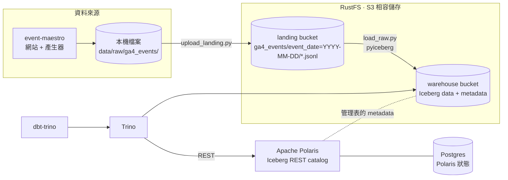

# data-symphony

一個可以在筆電上用 `docker compose` 跑起來的迷你 lakehouse，用來練習資料架構與 pipeline。
資料來源是 [event-maestro](https://github.com/HommerChiu/event-maestro)（一個知識分享網站）產生的 GA4 使用者事件，
學到的東西整理在 [through-virtuoso](https://github.com/HommerChiu/through-virtuoso)。

## 架構



| 層 | 位置 | 誰產生 | 說明 |
|---|---|---|---|
| landing | `s3://landing/ga4_events/event_date=YYYY-MM-DD/*.jsonl` | `ingestion/upload_landing.py` | event-maestro 輸出的原樣鏡像，GA4 BigQuery export 格式 |
| bronze | `iceberg.raw.ga4_events` | `ingestion/load_raw.py` | 原封不動的巢狀結構，以 `event_date` 分區，每天整區 overwrite |
| silver | `iceberg.staging.stg_ga4__events` | dbt（incremental merge） | 攤平 `event_params`、轉時區、去除重複列、產生 `event_key` / `session_key` |
| gold | `iceberg.marts.*` | dbt（table） | `fct_sessions`、`dim_users`、`fct_article_daily`、`fct_search_terms_daily` |

| 服務 | 網址 | 帳密 |
|---|---|---|
| RustFS console | http://localhost:9001 | `rustfsadmin` / `rustfsadmin` |
| Polaris API | http://localhost:8181 | client `root` / `s3cr3t` |
| Trino UI | http://localhost:8080 | 任意使用者名稱 |

設計上的取捨與踩過的坑寫在 [docs/architecture.md](docs/architecture.md)。

## 快速開始

需要 Docker（含 compose）、Python 3.11+，以及放在旁邊的 [event-maestro](https://github.com/HommerChiu/event-maestro) checkout
（預設路徑 `../event-maestro`，可以用 `EVENT_MAESTRO_DIR=...` 改）。

```bash
make up          # 啟動 RustFS、Postgres、Polaris、Trino，並建立 bucket 與 catalog
make install     # 建立 .venv，安裝 pyiceberg 與 dbt-trino
make pipeline    # event-maestro 產生 14 天資料 -> 上傳 landing -> 載入 bronze -> dbt build（含測試）
make trino       # 開 Trino CLI 查資料
```

自己在 event-maestro 網站上點來點去之後，跑 `make ingest` 就會把新的事件（`collector.jsonl`）一起帶進來。

在 Trino 裡試試看：

```sql
-- 每篇文章的閱讀漏斗
SELECT article_title, sum(views) AS views, sum(sessions_read_50) AS read_50,
       sum(sessions_read_100) AS read_100, sum(likes) AS likes
FROM marts.fct_article_daily
GROUP BY 1 ORDER BY 2 DESC;

-- 各流量來源的 engaged session 比例
SELECT source, medium, count(*) AS sessions, round(avg(cast(is_engaged AS double)), 3) AS engaged_rate
FROM marts.fct_sessions
GROUP BY 1, 2 ORDER BY 3 DESC;

-- Iceberg metadata：看 staging 表每次 dbt run 產生的 snapshot
SELECT committed_at, operation, summary['added-records'] AS added
FROM staging."stg_ga4__events$snapshots";
```

其他指令：

```bash
make generate DAYS=30 USERS=500 SEED=7          # 用 event-maestro 產生另一批資料
make upload                                     # 只把 event-maestro 的輸出上傳到 landing
make load                                       # 只跑 landing -> bronze
make dbt                                        # 只跑 dbt
make down                                       # 停止（資料保留）
make clean                                      # 停止並刪除所有資料
```

## 資料來源：event-maestro

資料格式以 event-maestro 的[資料契約](https://github.com/HommerChiu/event-maestro/blob/main/docs/data-contract.md)為準：
`<output>/raw/ga4_events/event_date=YYYY-MM-DD/<source>.jsonl`，每一行是一筆 GA4 BigQuery export row。

- `upload_landing.py` 原樣鏡像到 `s3://landing/ga4_events/`，同名檔案覆蓋，所以重跑安全。
- `load_raw.py` 的 `SCHEMA` 對應 event-maestro 的 `schema/ga4_event.schema.json`；`app_info`、`event_dimensions`、`ecommerce`、`items` 在知識網站永遠是空的，不載入。
  資料夾日期和列裡的 `event_date` 不一致時會直接報錯，因為分區 overwrite 靠這個假設。
- event-maestro 的 `--duplicate-rate` 會故意寫入重複列（`make pipeline` 預設 1%），bronze 保留原樣，`stg_ga4__events` 用 `event_key` 去重。
- 出現事件字典以外的新事件時，dbt 的 `accepted_values` 測試會發 warning，但不會擋 pipeline。

## 目錄

```
docker-compose.yml         所有服務
infra/
  rustfs/create_buckets.py 建 bucket（純標準函式庫的 SigV4）
  polaris/create_catalog.py 建 Polaris catalog 與權限
  trino/catalog/            Trino 的 Iceberg REST catalog 設定
ingestion/
  upload_landing.py         event-maestro 本機輸出 -> landing bucket
  load_raw.py               landing -> Iceberg bronze
dbt/
  models/staging/           silver：stg_ga4__events（incremental merge）
  models/marts/             gold：sessions / users / 文章閱讀漏斗 / 搜尋
```

## 接下來可以玩的

- [ ] Lightdash 接 Trino，把 marts 做成 dashboard
- [ ] 用 Iceberg metadata 表（`$snapshots`、`$files`、`$partitions`）做資料品質檢查
- [ ] Schema evolution：event-maestro 加新欄位時 bronze 怎麼跟著演進
- [ ] Time travel：`FOR VERSION AS OF` 比較兩次載入的差異
- [ ] Orchestration：用 Dagster 或 Airflow 排程每天的 load + dbt
- [ ] Spark 或 DuckDB 當第二個引擎，讀同一份 Iceberg 表
