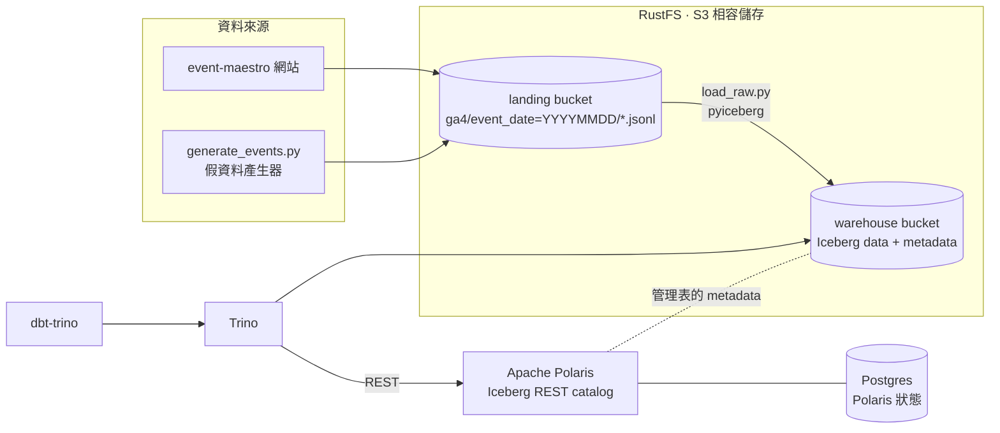

# data-symphony

一個可以在筆電上用 `docker compose` 跑起來的迷你 lakehouse，用來練習資料架構與 pipeline。
資料來源是 [event-maestro](https://github.com/HommerChiu/event-maestro)（一個知識分享網站）產生的 GA4 使用者事件，
學到的東西整理在 [through-virtuoso](https://github.com/HommerChiu/through-virtuoso)。

## 架構



| 層 | 位置 | 誰產生 | 說明 |
|---|---|---|---|
| landing | `s3://landing/ga4/event_date=YYYYMMDD/*.jsonl` | event-maestro / `generate_events.py` | GA4 BigQuery export 格式，一行一個事件 |
| bronze | `iceberg.raw.ga4_events` | `ingestion/load_raw.py` | 原封不動的巢狀結構，以 `event_date` 分區，每天整區 overwrite |
| silver | `iceberg.staging.stg_ga4__events` | dbt（incremental merge） | 攤平 `event_params`、轉時區、產生 `event_key` / `session_key` |
| gold | `iceberg.marts.*` | dbt（table） | `fct_sessions`、`dim_users`、`fct_article_daily`、`fct_search_terms_daily` |

| 服務 | 網址 | 帳密 |
|---|---|---|
| RustFS console | http://localhost:9001 | `rustfsadmin` / `rustfsadmin` |
| Polaris API | http://localhost:8181 | client `root` / `s3cr3t` |
| Trino UI | http://localhost:8080 | 任意使用者名稱 |

設計上的取捨與踩過的坑寫在 [docs/architecture.md](docs/architecture.md)。

## 快速開始

需要 Docker（含 compose）與 Python 3.11+。

```bash
make up          # 啟動 RustFS、Postgres、Polaris、Trino，並建立 bucket 與 catalog
make install     # 建立 .venv，安裝 pyiceberg 與 dbt-trino
make pipeline    # 產生 7 天假資料 -> 載入 bronze -> dbt build（含測試）
make trino       # 開 Trino CLI 查資料
```

在 Trino 裡試試看：

```sql
-- 哪篇文章最多人讀完？
SELECT article_title, sum(views) AS views, round(avg(completion_rate), 3) AS completion_rate
FROM marts.fct_article_daily
GROUP BY 1 ORDER BY 2 DESC;

-- 各流量來源的 engaged session 比例
SELECT source, medium, count(*) AS sessions, round(avg(cast(is_engaged AS double)), 3) AS engaged_rate
FROM marts.fct_sessions
GROUP BY 1, 2 ORDER BY 3 DESC;

-- Iceberg metadata：看 staging 表每次 dbt run 產生的 snapshot
SELECT committed_at, operation, summary['added-records'] AS added
FROM staging."stg_ga4__events$snapshots";
```

其他指令：

```bash
make generate START=2026-09-01 DAYS=3 SEED=7   # 產生另一批資料（同一個 seed 重跑會覆蓋，不會重複）
make load                                       # 只跑 landing -> bronze
make dbt                                        # 只跑 dbt
make down                                       # 停止（資料保留）
make clean                                      # 停止並刪除所有資料
```

## 資料契約（給 event-maestro）

event-maestro 只要把事件寫成 JSONL 放到 `s3://landing/ga4/event_date=YYYYMMDD/` 底下，後面的 pipeline 就會接手。
每一行是一筆 [GA4 BigQuery export](https://support.google.com/analytics/answer/7029846) 格式的 row，
目前會讀的欄位定義在 [`ingestion/load_raw.py`](ingestion/load_raw.py) 的 `SCHEMA`：

- `event_date`、`event_timestamp`（微秒）、`event_name`
- `event_params`：`[{key, value: {string_value | int_value | float_value | double_value}}]`，每個事件都要有 `ga_session_id`、`ga_session_number`
- `user_pseudo_id`、`user_id`、`user_first_touch_timestamp`
- `device`、`geo`、`traffic_source`、`collected_traffic_source`、`platform`、`stream_id`

知識分享網站的事件：`first_visit`、`session_start`、`page_view`、`user_engagement`、`scroll`、`select_content`、
`view_search_results`、`article_complete`、`bookmark`、`share`、`sign_up`。
文章相關事件帶 `article_id`、`article_category`、`article_author` 參數。
出現新的事件名稱時 dbt 的 `accepted_values` 測試會發 warning，但不會擋 pipeline。

## 目錄

```
docker-compose.yml         所有服務
infra/
  rustfs/create_buckets.py 建 bucket（純標準函式庫的 SigV4）
  polaris/create_catalog.py 建 Polaris catalog 與權限
  trino/catalog/            Trino 的 Iceberg REST catalog 設定
ingestion/
  generate_events.py        知識分享網站的 GA4 假資料
  load_raw.py               landing -> Iceberg bronze
dbt/
  models/staging/           silver：stg_ga4__events（incremental merge）
  models/marts/             gold：sessions / users / 文章 / 搜尋
```

## 接下來可以玩的

- [ ] Lightdash 接 Trino，把 marts 做成 dashboard
- [ ] 用 Iceberg metadata 表（`$snapshots`、`$files`、`$partitions`）做資料品質檢查
- [ ] Schema evolution：event-maestro 加新欄位時 bronze 怎麼跟著演進
- [ ] Time travel：`FOR VERSION AS OF` 比較兩次載入的差異
- [ ] Orchestration：用 Dagster 或 Airflow 排程每天的 load + dbt
- [ ] Spark 或 DuckDB 當第二個引擎，讀同一份 Iceberg 表
